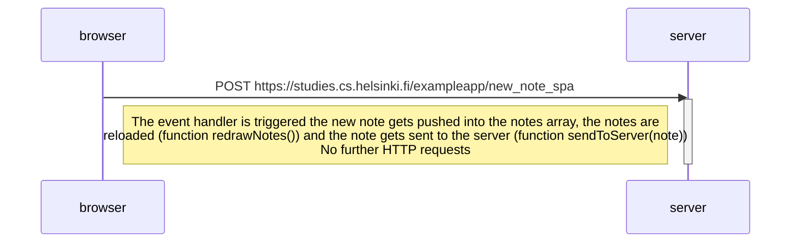

```mermaid
sequenceDiagram
    participant browser
    participant server

    browser->>server: POST https://studies.cs.helsinki.fi/exampleapp/new_note_spa
    activate server
    Note right of browser: The event handler is triggered the new note gets pushed into the notes array, the notes are <br />reloaded (function redrawNotes()) and the note gets sent to the server (function sendToServer(note))<br /> No further HTTP requests
    deactivate server
```